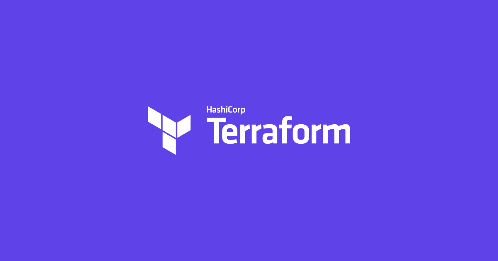

<p align="center">
  
</p>
<h1 style="font-size: 56px; margin: 0; padding: 0;" align="center">
  terraform-min-max
</h1>
<p align="center">
  
</p>
<p align="center">
  <a href="https://github.com/clowdhaus/terraform-min-max/actions?query=workflow%3Aintegration">
    
  </a>
</p>

GitHub action used to evaluate the Terraform minimum and maximum versions permitted

## Usage

```yml
steps:
  - name: Checkout
    uses: actions/checkout@v6

  - name: Extract Terraform min/max versions
    id: minMax
    uses: clowdhaus/terraform-min-max@v3
    with:
      # The project root directory (.) is used as the default
      directory: .
outputs:
  minVersion: ${{ steps.minMax.outputs.minVersion }}
  maxVersion: ${{ steps.minMax.outputs.maxVersion }}
```

## Scenarios

### Extract minimum and maximum permitted versions of Terraform for use in matrix pipelines

```yml
jobs:
  versionExtract:
    name: Extract Min/Max Versions
    runs-on: ubuntu-latest

    steps:
      - name: Checkout
        uses: actions/checkout@v6

      - name: Extract Terraform min/max versions
        id: minMax
        uses: clowdhaus/terraform-min-max@v3
        with:
          directory: tests/0.13
    outputs:
      minVersion: ${{ steps.minMax.outputs.minVersion }}
      maxVersion: ${{ steps.minMax.outputs.maxVersion }}

  versionEvaluate:
    name: Evaluate Min/Max Versions
    runs-on: ubuntu-latest
    needs: versionExtract
    strategy:
      matrix:
        version:
          - ${{ needs.versionExtract.outputs.minVersion }}
          - ${{ needs.versionExtract.outputs.maxVersion }}

    steps:
      - name: Checkout
        uses: actions/checkout@v6

      - name: Install Terraform v${{ matrix.version }}
        uses: hashicorp/setup-terraform@v4
        with:
          terraform_version: ${{ matrix.version }}

      - name: Initialize and validate v${{ matrix.version }}
        run: |
          cd tests/0.13
          terraform init
          terraform validate
```

## Getting Started

The following instructions will help you get setup for development and testing purposes.

### Prerequisites

- [Node.js](https://nodejs.org/) (v24+)
- [npm](https://www.npmjs.com/) (included with Node.js)

### Setup

Install dependencies:

```bash
npm install
```

### Development

```bash
# Run linting, tests, and compile
npm run all

# Run tests only
npm run test

# Run linting only
npm run lint

# Compile dist/index.js
npm run compile
```

## Contributing

Please read [CODE_OF_CONDUCT.md](.github/CODE_OF_CONDUCT.md) for details on our code of conduct and the process for submitting pull requests.

## Changelog

Please see the [GitHub releases](https://github.com/clowdhaus/terraform-min-max/releases) for details on individual releases.
